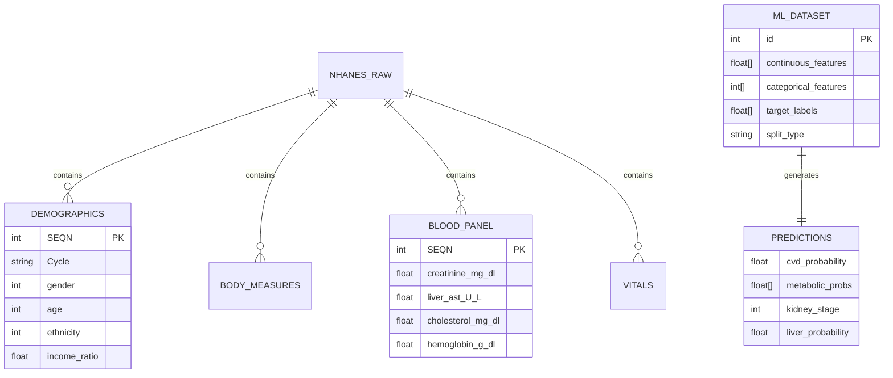

# Project Master Documentation
## NHANES Multi-Task Clinical Prediction Platform

> **Last Updated:** December 2024  
> **Document Purpose:** Source of truth for high-level architectural presentation

---

# 1. Business & Value Proposition

## 1.1 Primary Purpose

This platform is a **Clinical Health Risk Intelligence System** that predicts multiple chronic disease risks from a single blood test. It transforms routine NHANES (National Health and Nutrition Examination Survey) biomarkers into actionable clinical risk scores, enabling:

- **Early Detection:** Identify patients at risk before symptoms manifest
- **Preventive Care:** Enable clinicians to intervene with lifestyle or pharmaceutical recommendations
- **Population Health Analytics:** Assess community-level health trends from standardized biomarkers

## 1.2 Target Users

Based on the features and UI analysis:

| User Type | Use Case | Evidence from Codebase |
|-----------|----------|------------------------|
| **Clinicians / Healthcare Providers** | Point-of-care risk assessment during patient visits | Biomarker input sliders with medical units (mg/dL, mmol/L, U/L) |
| **Health Researchers** | Population-level risk modeling and epidemiological studies | NHANES multi-cycle data integration (2013-2023) |
| **Data Scientists / ML Engineers** | Model development, validation, and deployment | Modular ML pipeline with ONNX export, configurable hyperparameters |
| **Public Health Officials** | Community health screening programs | Multi-task simultaneous prediction for efficient screening |

## 1.3 Unique Selling Points (Core Problems Solved)

### USP 1: **Multi-Task Learning Architecture**
> *Problem:* Traditional single-disease models miss cross-organ correlations  
> *Solution:* Shared-bottom neural network learns inter-organ dependencies, improving rare phenotype detection (e.g., 51% recall on Macroalbuminuria vs. typical 15-20%)

### USP 2: **4 Simultaneous Clinical Predictions from 29 Biomarkers**
| Task | Clinical Outcome | Key Metric |
|------|------------------|------------|
| **Cardiovascular** | Heart disease risk | 0.83 ROC-AUC, 80% recall @ 0.33 threshold |
| **Metabolic Syndrome** | 5-component NCEP-ATP III criteria | 0.97 AUC (waist), 0.74 AUC (triglycerides) |
| **Kidney Dysfunction** | ACR-based nephropathy staging | Ordinal 3-class (Normal/Micro/Macro) |
| **Liver Dysfunction** | Gender-adjusted ALT elevation | 0.93 ROC-AUC |

### USP 3: **Clinical-Grade Data Harmonization**
> *Problem:* Raw NHANES data spans 10 years with inconsistent variable naming and measurement protocols  
> *Solution:* Three-stage ETL pipeline with biological bounds enforcement, Three-State Logic for missing values (NaN ≠ false negative), and MICE imputation for features only

### USP 4: **Ordinal Binary Decomposition for Kidney Disease**
> *Problem:* Standard multi-class classifiers treat all misclassifications equally  
> *Solution:* Rank-consistent encoding `[0,0]→Normal, [1,0]→Micro, [1,1]→Macro` enforces disease progression constraint

### USP 5: **Production-Ready Deployment**
- ONNX-exported model for cross-platform inference
- FastAPI backend with real-time predictions (<100ms)
- Modern React UI with biomarker normalization and "Healthy Stats" presets

---

# 2. Technical Architecture

## 2.1 Tech Stack

### Languages
| Component | Language | Version |
|-----------|----------|---------|
| ETL Pipeline | Python | 3.10+ |
| Model Training | Python | 3.10+ |
| Backend API | Python | 3.10+ |
| Frontend | JavaScript (JSX) | ES2022 |

### Frameworks

| Layer | Technology | Purpose |
|-------|------------|---------|
| **ML** | PyTorch 2.0+ | Neural network training with custom loss functions |
| **ML Inference** | ONNX Runtime 1.16+ | Cross-platform model inference |
| **Backend** | FastAPI 0.104+ | REST API with async request handling |
| **Frontend** | React 19.2+ / Vite 7.2+ | Modern SPA with hot module replacement |
| **Styling** | TailwindCSS 4.1+ | Utility-first CSS framework |

### Primary Libraries

| Category | Libraries |
|----------|-----------|
| **Data Processing** | pandas, numpy, sqlite3, scikit-learn |
| **ML Training** | torch, torch.nn, torch.optim |
| **Imputation** | sklearn.impute.IterativeImputer (MICE) |
| **Visualization** | matplotlib, seaborn (EDA notebooks) |
| **API** | fastapi, uvicorn, pydantic |
| **Frontend** | react, react-dom, lucide-react |

## 2.2 File Structure

```
MTL Refactoring/
│
├── 1. ETL/                           # Data Pipeline (Stage 1-3)
│   ├── Raw Data/                     # NHANES .xpt files (70 files)
│   │   ├── Demo_data/                # Demographics
│   │   ├── BioChemistry_data/        # Blood panel
│   │   ├── Cholesterol_data/         # Lipid profiles
│   │   └── ...                       # 14 data categories
│   ├── 01_ingestion.py               # Stage 1: XPT → SQLite staging
│   ├── 02_harmonization.py           # Stage 2: Variable mapping & clinical bounds
│   ├── 03_transformation.py          # Stage 3: MICE imputation & train/test split
│   ├── ELT_Config.json               # Externalized ETL parameters
│   └── ETL_Technical_Handover_Report.md
│
├── 2. EDA/                           # Exploratory Data Analysis
│   ├── 01_data_exploration.ipynb     # Dataset overview
│   ├── 02_data_quality.ipynb         # Missing value analysis
│   ├── 03-06_*.ipynb                 # Statistical analyses
│   ├── 07_EDA_Summary.ipynb          # Final summary notebook
│   └── Summary.md                    # Class imbalance report
│
├── 3. Model/                         # Multi-Task Learning Core
│   ├── 01_config.py                  # Legacy config (deprecated)
│   ├── config.json                   # Active hyperparameter config
│   ├── 02_dataset.py                 # MaskedDataLoader with 3-state logic
│   ├── 03_model.py                   # SharedBottomMTL architecture
│   ├── 04_train.py                   # Training loop with uncertainty weighting
│   ├── 05_evaluate.py                # Per-class metrics & threshold tuning
│   ├── 07_streamlit_app.py           # Standalone demo UI
│   ├── trained_model.pth             # PyTorch checkpoint (4.9 MB)
│   └── trained_model.onnx            # Production export (22 KB + 4.9 MB data)
│
├── backend/                          # FastAPI Server
│   ├── main.py                       # API endpoints & model loading
│   ├── requirements.txt              # Python dependencies
│   └── README.md                     # API documentation
│
├── frontend/                         # React SPA
│   ├── src/
│   │   ├── App.jsx                   # Main application (590 LOC)
│   │   ├── App.css                   # Custom styling (25 KB)
│   │   ├── components/Banner.jsx     # Hero banner component
│   │   └── main.jsx                  # React entry point
│   ├── package.json                  # Node dependencies
│   ├── vite.config.js                # Build configuration
│   └── tailwind.config.js            # TailwindCSS setup
│
├── databases/                        # SQLite Databases
│   ├── nhanes_1st.db                 # Raw ingested data (32 MB)
│   ├── ML_data.db                    # Transformed ML-ready data (10 MB)
│   └── SQL_queries/                  # Target generation queries
│
├── Classification Model/             # Single-task kidney classifier
├── Regression Neural Network/        # ACR value predictor
└── docs/                             # Additional documentation
```

### Folder Logic

| Directory | Purpose | Data Flow Stage |
|-----------|---------|-----------------|
| `1. ETL/` | Data acquisition & preparation | Raw → Staged → Harmonized |
| `2. EDA/` | Statistical validation & insight discovery | Analysis artifacts |
| `3. Model/` | ML training, evaluation, export | Transformed → Predictions |
| `backend/` | API layer for model serving | Inference runtime |
| `frontend/` | User interface layer | Presentation layer |
| `databases/` | Persistent data storage | SQLite persistence |

## 2.3 Data Model

### Primary Entities



### Data Flow

```
┌─────────────────┐    ┌─────────────────┐    ┌─────────────────┐
│  NHANES .xpt    │───▶│  nhanes_1st.db  │───▶│   ML_data.db    │
│  (70 files)     │    │  (Raw Staging)  │    │ (ML-Ready)      │
└─────────────────┘    └─────────────────┘    └─────────────────┘
       │                       │                      │
       ▼                       ▼                      ▼
  01_ingestion.py       02_harmonization.py    03_transformation.py
       │                       │                      │
       ▼                       ▼                      ▼
  - Cycle tagging         - Clinical bounds       - MICE imputation
  - Table creation        - Variable renaming     - One-hot encoding
  - Schema detection      - Target computation    - Stratified split
```

### Target Variables (8 predictions across 4 tasks)

| Task | Target Column | Type | Class Distribution |
|------|---------------|------|-------------------|
| CVD | `has_cardiovascular_disease` | Binary | 88:12 (Healthy:Disease) |
| Metabolic | `high_waist_circumference` | Binary | 37:63 |
| Metabolic | `high_triglycerides_mg_dl` | Binary | 73:27 |
| Metabolic | `low_hdl_mg_dl` | Binary | 71:29 |
| Metabolic | `high_blood_pressure` | Binary | 56:44 |
| Metabolic | `high_glucose_mg_dl` | Binary | 62:38 |
| Kidney | `albuminuria_risk` | Ordinal (3-class) | 85:11:4 |
| Liver | `liver_dysfunction` | Binary | 85:15 |

## 2.4 Key Components

### SharedBottomMTL (`03_model.py`)
**Role:** Core neural network architecture implementing hard parameter sharing

```python
class SharedBottomMTL(nn.Module):
    """
    Architecture:
    - Input: 30 continuous features (normalized)
    - Backbone: 512 → 384 → 256 (LeakyReLU + BatchNorm + Dropout)
    - 4 Task Heads:
        - head_cardio: Linear(256, 1) - Binary
        - head_metabolic: Linear(256, 5) - Multi-label
        - head_kidney: Linear(256, 2) - Ordinal decomposition
        - head_liver: Linear(256, 1) - Binary
    """
```

### MaskedDataLoader (`02_dataset.py`)
**Role:** Handles Three-State Logic for missing target values

- `0.0` = Negative/Normal → Include in loss
- `1.0`/`2.0` = Positive/Elevated → Include in loss  
- `NaN` = Not tested → **Exclude** via mask (zero gradient)

### UncertaintyWeightedLoss (`04_train.py`)
**Role:** Automatic task balancing via learned log-variance parameters

$$L_{total} = \sum_{i=1}^{4} \frac{1}{2\sigma_i^2} L_i + \log(\sigma_i)$$

### FastAPI Prediction Router (`backend/main.py`)
**Role:** REST API endpoints for real-time inference

| Endpoint | Method | Input | Output |
|----------|--------|-------|--------|
| `/` | GET | - | Model availability status |
| `/features/{model}` | GET | model_name | Feature list & count |
| `/predict/classification` | POST | 30 features | Kidney class + probabilities |
| `/predict/regression` | POST | 35 features | ACR value + risk category |
| `/predict/mtl` | POST | 30 features | 4 clinical outcomes |

### React Prediction UI (`App.jsx`)
**Role:** Interactive biomarker input with real-time visualization

- **Biomarker sliders** with medical units and normalization
- **Model selector** (Classification/Regression/MTL)
- **Healthy Stats preset** - preconfigured optimal values
- **Result rendering** - color-coded risk visualization

---

# 3. Operational Overview

## 3.1 User Flow

```mermaid
flowchart TD
    A[User lands on Home Page] --> B{Select Action}
    B -->|Learn More| C[About Page]
    B -->|View Models| D[Models Page]
    B -->|Make Prediction| E[Predict Page]
    
    E --> F[Select Model Type]
    F -->|Classification| G[30-feature kidney classifier]
    F -->|Regression| H[35-feature ACR predictor]
    F -->|MTL| I[30-feature 4-task model]
    
    G & H & I --> J[Enter Biomarkers via Sliders]
    J --> K{Use Healthy Preset?}
    K -->|Yes| L[Load optimal values]
    K -->|No| M[Manually adjust sliders]
    
    L & M --> N[Click Predict Button]
    N --> O[API POST /predict/{model}]
    O --> P[Model Inference]
    P --> Q[Display Risk Results]
    
    Q --> R{Review Outcome}
    R -->|Adjust Values| J
    R -->|Try Different Model| F
    R -->|Done| S[End Session]
```

### Step-by-Step User Journey

1. **Landing** → User sees hero section with platform statistics (3 models, 34K samples, 90% accuracy)
2. **Navigation** → Selects "Predict" from navbar
3. **Model Selection** → Chooses from Classification (kidney stages), Regression (ACR value), or MTL (4 tasks)
4. **Biomarker Input** → Uses sliders with real-world medical units (mg/dL, bpm, etc.)
5. **Optional Preset** → Clicks "💚 Healthy Stats" to load clinically optimal values
6. **Categorical Selection** → Sets Gender, Ethnicity, and Smoking status
7. **Prediction** → Clicks "🔮 Predict" button
8. **Results Display** → Views color-coded risk assessment with probability scores
9. **Iteration** → Adjusts biomarkers to explore "what-if" scenarios

## 3.2 Integration Points

### APIs

| Integration | Type | Endpoint | Protocol |
|-------------|------|----------|----------|
| **Frontend → Backend** | REST | `http://localhost:8000/predict/{model}` | HTTP POST (JSON) |
| **Backend → ONNX Runtime** | Library | In-process | Python API |
| **ETL → Database** | Native | SQLite connection | SQL |

### API Request/Response Schema

**Request (MTL Model):**
```json
{
  "features": [0.38, 0.5, 0.35, 0.5, 0.32, 0.35, 0.4, 0.6, ...]
}
```

**Response (MTL Model):**
```json
{
  "cardiovascular_disease": {"probability": 0.1234, "risk": "Low"},
  "metabolic_syndrome": {
    "waist": 0.1523,
    "triglycerides": 0.3421,
    "hdl": 0.2156,
    "blood_pressure": 0.4523,
    "glucose": 0.2134
  },
  "kidney_dysfunction": {
    "at_least_micro": 0.0856,
    "macro": 0.0123,
    "stage": "Normal"
  },
  "liver_dysfunction": {"probability": 0.0934, "risk": "Low"}
}
```

### Databases

| Database | Type | Purpose | Size |
|----------|------|---------|------|
| `nhanes_1st.db` | SQLite | Raw NHANES staging (13 tables) | 32 MB |
| `ML_data.db` | SQLite | ML-ready dataset (train/test splits) | 10 MB |
| `mtl_hpo.db` | SQLite | Hyperparameter optimization history | 188 KB |

### Authentication

> **Current State:** No authentication implemented  
> **CORS:** Fully open (`allow_origins=["*"]`) for development

---

## Appendix: Configuration Reference

### Model Hyperparameters (`config.json`)

| Parameter | Value | Description |
|-----------|-------|-------------|
| `batch_size` | 128 | Training batch size |
| `learning_rate` | 0.00024 | Adam optimizer LR |
| `epochs` | 20 | Training epochs |
| `hidden_dim` | 512 | Shared backbone dimension |
| `dropout_rate` | 0.05 | Regularization dropout |
| `weight_decay` | 0.00042 | L2 regularization |
| `focal_gamma` | 1.0 | Focal loss gamma |

### Class Weights

| Task | Weight | Rationale |
|------|--------|-----------|
| CVD | 7.36 | 88:12 imbalance |
| Liver | 5.62 | 85:15 imbalance |
| Triglycerides | 3.76 | 73:27 imbalance |
| HDL | 2.40 | 71:29 imbalance |
| Blood Pressure | 1.78 | 56:44 imbalance |

### Optimal Thresholds (Post-Training Calibration)

| Task | Threshold | Recall Achieved |
|------|-----------|-----------------|
| CVD | 0.33 | 80% |
| Liver | 0.44 | 70% |

---

*Document generated by automated codebase analysis. For technical questions, refer to inline documentation in source files.*
