# 🏥 NHANES Multi-Task Clinical Prediction Model

**Predicting 4 clinical outcomes simultaneously from a single blood draw using Multi-Task Learning.**

[](https://python.org)
[](https://pytorch.org)
[](https://onnx.ai)
[](LICENSE)


---

## 📋 Project Overview

This project implements a **Multi-Task Learning (MTL)** neural network that predicts cardiovascular disease, metabolic syndrome, kidney dysfunction, and liver dysfunction from routine NHANES biomarkers. Unlike single-task models, the shared-backbone architecture learns cross-organ correlations that improve prediction accuracy, particularly for rare clinical phenotypes.

| Metric | Value |
|--------|-------|
| **Dataset** | NHANES 2013-2023 |
| **Population** | 34,097 U.S. adults (Age ≥ 20) |
| **Input Features** | 29 biomarkers |
| **Output Tasks** | 4 clinical heads (9 total predictions) |
| **Model Architecture** | SharedBottomMTL (217K parameters) |

---

## ✨ Key Features

| Feature | Description |
|---------|-------------|
| **🧠 Ordinal Kidney Head** | 2-node binary decomposition enforces disease severity progression (Normal → Micro → Macro) |
| **⚖️ Uncertainty Weighting** | Automatic task balancing via learned variance (Kendall et al., 2018) |
| **🎯 Masked Loss Functions** | Three-State Logic (1/0/NaN) handles 60% missing in fasting labs without false negatives |
| **📊 Clinical Thresholds** | Gender-adjusted liver cutoffs, KDIGO-aligned kidney staging |
| **🔧 Threshold Optimization** | Post-training calibration achieves 80% CVD recall (0.33 threshold) |

---

## 🏗️ Architecture


### Shared-Bottom Multi-Task Learning

The model uses **hard parameter sharing** where a shared encoder learns cross-organ correlations, while task-specific heads specialize for each clinical outcome.

```
             Input: 29 Biomarkers
                     │
                BatchNorm1d
                     │
        ┌─────────────────────────────┐
        │   Shared Backbone           │
        │   512 → 256 → 256           │
        │   LeakyReLU(0.1) + BN + DO  │
        └─────────────────────────────┘
                     │
        ┌────────────┼────────────┬───────────┐
        ▼            ▼            ▼           ▼
    ┌──────┐    ┌──────┐    ┌──────┐    ┌──────┐
    │ CVD  │    │ Met  │    │Kidney│    │Liver │
    │ (1)  │    │ (5)  │    │ (2)  │    │ (1)  │
    └──────┘    └──────┘    └──────┘    └──────┘
     Focal       BCE      Ordinal BCE   Focal
     Loss       Loss      w/ pos_weight  Loss
```

### Loss Function Architecture

The total loss combines task-specific losses with **Uncertainty Weighting** (Kendall et al., 2018):

$$L_{total} = \sum_{i=1}^{4} \frac{1}{2\sigma_i^2} L_i + \log(\sigma_i)$$

Where $\sigma_i$ is a learned parameter per task that automatically balances the contributions.

| Task | Loss Function | Class Handling |
|------|---------------|----------------|
| CVD | `FocalLoss(γ=2.0)` | 7.36× implicit up-weighting |
| Metabolic | `BCEWithLogitsLoss` | Per-component pos_weight |
| Kidney | `BCEWithLogitsLoss` | pos_weight=[4.5, 30.0] |
| Liver | `FocalLoss(γ=2.0)` | 5.62× implicit up-weighting |

### Ordinal Binary Decomposition (Kidney)

Traditional 3-class classification treats all misclassifications equally. Our **rank-consistent ordinal encoding** respects disease progression:

| Class | Encoding | Meaning |
|-------|----------|---------|
| Normal | `[0, 0]` | ACR < 30 mg/g |
| Micro | `[1, 0]` | 30 ≤ ACR < 300 |
| Macro | `[1, 1]` | ACR ≥ 300 |

**Key Insight:** To predict Macro, the model must first activate Node A (disease present), enforcing the biological constraint that Macroalbuminuria is a progression of Microalbuminuria.

---

## 🔄 Pipeline

```mermaid
flowchart LR
    subgraph ETL["1. ETL Pipeline"]
        A[NHANES .xpt Files] --> B[01_ingestion.py]
        B --> C[SQLite Staging]
        C --> D[02_harmonization.py]
        D --> E[Clinical Thresholds]
        E --> F[03_transformation.py]
        F --> G[MICE Imputation]
        G --> H[Stratified Split]
    end

    subgraph Training["2. Model Training"]
        H --> I[02_dataset.py]
        I --> J[Masked DataLoader]
        J --> K[04_train.py]
        K --> L[Uncertainty Weighting]
        L --> M[trained_model.pth]
    end

    subgraph Deploy["3. Deployment"]
        M --> N[ONNX Export]
        N --> O[07_streamlit_app.py]
        O --> P[Risk Predictions]
    end

    style ETL fill:#e1f5fe
    style Training fill:#fff3e0
    style Deploy fill:#e8f5e9
```



---

## 📊 Prediction Tasks

### Task A: Cardiovascular Disease
| Metric | Value |
|--------|-------|
| **Type** | Binary Classification |
| **Target** | Self-reported CVD history |
| **Class Balance** | 88:12 (Healthy:CVD) |
| **Recall @ 0.33** | **80%** |
| **ROC-AUC** | 0.83 |

### Task B: Metabolic Syndrome (5 Components)
| Component | Threshold | ROC-AUC |
|-----------|-----------|---------|
| Waist | NCEP-ATP III | 0.97 |
| Triglycerides | ≥150 mg/dL | 0.74 |
| HDL | M<40 / F<50 mg/dL | 0.74 |
| Blood Pressure | ≥130/85 mmHg | 0.75 |
| Fasting Glucose | ≥100 mg/dL | 0.68 |

### Task C: Kidney Dysfunction (Ordinal)
| Class | ACR Range | Recall |
|-------|-----------|--------|
| Normal | <30 mg/g | 82% |
| Microalbuminuria | 30-300 mg/g | 22% |
| **Macroalbuminuria** | >300 mg/g | **51%** |

**Innovation:** Ordinal Binary Decomposition encodes [0,0]→Normal, [1,0]→Micro, [1,1]→Macro

### Task D: Liver Dysfunction
| Metric | Value |
|--------|-------|
| **Type** | Binary (Gender-Adjusted) |
| **Threshold** | Male: ALT>40, Female: ALT>25 |
| **Recall @ 0.44** | **70%** |
| **ROC-AUC** | 0.93 |

---

## 📁 Repository Structure

```
NHANES-MTL/
├── 1. ETL/
│   ├── 01_ingestion.py          # NHANES → SQLite
│   ├── 02_harmonization.py      # Clinical thresholds
│   ├── 03_transformation.py     # MICE + stratification
│   └── ELT_Config.json          # Externalized bounds
│
├── 2. EDA/
│   ├── 01-07 notebooks          # Feature analysis
│   └── Summary.md               # Class imbalance report
│
├── 3. Model/
│   ├── 01_config.py             # Hyperparameters
│   ├── 02_dataset.py            # Masked DataLoader
│   ├── 03_model.py              # SharedBottomMTL
│   ├── 04_train.py              # Uncertainty weighting
│   ├── 05_evaluate.py           # Per-class metrics
│   ├── 07_streamlit_app.py      # Web interface
│   ├── trained_model.pth        # PyTorch checkpoint
│   └── trained_model.onnx       # Production export
│
└── docs/                        # Technical documentation
```

---

## 🚀 Quick Start

### Installation
```bash
git clone https://github.com/OwlTheBird/Multilayer-Perceptron-Clinical-Prediction-Model.git
cd Multilayer-Perceptron-Clinical-Prediction-Model

pip install torch numpy pandas scikit-learn streamlit onnx
```

### Training
```bash
cd "3. Model"
python 04_train.py
```

### Evaluation
```bash
python 05_evaluate.py
```

### Web Interface
```bash
streamlit run 07_streamlit_app.py
```

---

## ⚙️ Training Strategy

### Hyperparameters

| Parameter | Value | Rationale |
|-----------|-------|-----------|
| **Epochs** | 20 | Early stopping not needed with Cosine Annealing |
| **Batch Size** | 128 | Balance between gradient stability and speed |
| **Learning Rate** | 1e-3 | Standard for Adam with warm restarts |
| **Weight Decay** | 1e-4 | L2 regularization for multicollinearity |
| **Scheduler** | CosineAnnealingWarmRestarts | T_0=10, T_mult=2, helps escape plateaus |
| **Gradient Clipping** | max_norm=1.0 | Prevents explosion from high pos_weights |

### Training Features

- **Focal Loss** (γ=2.0) for CVD and Liver - down-weights easy negatives
- **Masked Loss** - NaN targets contribute zero gradient
- **Uncertainty Weighting** - learns task importance automatically
- **Early gradient clipping** - stabilizes training with aggressive class weights

---

## 🔬 Data Preprocessing

### Three-State Logic

The pipeline preserves clinical data integrity through explicit handling of missing values:

| Value | Meaning | Loss Treatment |
|-------|---------|----------------|
| `0.0` | Tested negative / Normal | ✅ Include in backprop |
| `1.0` / `2.0` | Positive / Elevated | ✅ Include in backprop |
| `NaN` | **Not tested** | ❌ Exclude via mask |

> [!CAUTION]
> Never fill target NaNs with zeros - this creates false "healthy" labels and corrupts training.

### MICE Imputation

**Only input features** are imputed using Multivariate Imputation by Chained Equations:

```python
from sklearn.experimental import enable_iterative_imputer
from sklearn.impute import IterativeImputer

imputer = IterativeImputer(max_iter=10, random_state=42)
X_imputed = imputer.fit_transform(X)
```

**Benefits:**
- Preserves feature correlations (e.g., uses Waist + BP to predict missing BMI)
- Creates biologically plausible values, not statistical averages
- Memory efficient compared to KNN imputation

### Biological Bounds

| Variable | Min | Max | Rationale |
|----------|-----|-----|-----------|
| Pulse | 30 | 200 | Retains athletes, beta-blocker users |
| Systolic BP | 70 | 250 | Compatible with shock/crisis |
| BMI | 10 | 100 | Retains super-obese phenotype |

---

## 🎯 Production Configuration

```python
# Optimal thresholds for clinical deployment
OPTIMAL_THRESHOLDS = {
    'cvd': 0.33,    # 80% recall (default 0.5 gives only 21%)
    'liver': 0.44   # 70% recall (default 0.5 gives only 60%)
}

# Kidney ordinal weights (for rare class detection)
KIDNEY_WEIGHTS = [4.5, 30.0]  # [ACR≥30, ACR≥300]

# Training hyperparameters
HYPERPARAMETERS = {
    'batch_size': 128,
    'learning_rate': 1e-3,
    'epochs': 20,
    'weight_decay': 1e-4,
    'hidden_dim': 256
}
```

---

## 📖 Documentation

| Document | Description |
|----------|-------------|
| [ETL Technical Handover](1.%20ETL/ETL_Technical_Handover_Report.md) | Three-State Logic, biological bounds |
| [EDA Summary](2.%20EDA/Summary.md) | Class imbalances, 8 target profiles |
| [Model Evaluation Report](3.%20Model/MODEL_EVALUATION_REPORT.md) | Final metrics, production config |
| [Technical Post-Mortem](3.%20Model/TECHNICAL_POST_MORTEM.md) | Architectural decisions, leakage audit |

---

## ⚠️ Clinical Limitations

> [!IMPORTANT]
> This model detects **uncontrolled phenotypes**, not treated conditions.
> - Patients with successfully managed hypertension will classify as "Negative"
> - Cross-sectional albuminuria ≠ CKD (requires persistence >3 months)
> - NHANES survey weights are NOT applied

---

## 📜 License

MIT License. See [LICENSE](LICENSE) for details.

---

## 🙏 Acknowledgments

- **NHANES** - National Center for Health Statistics
- **Kendall et al., 2018** - Multi-task uncertainty weighting
- **KDIGO** - Kidney disease staging guidelines
