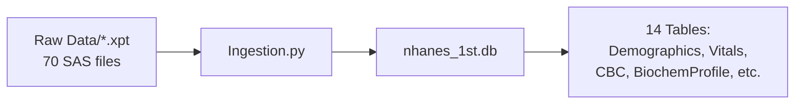
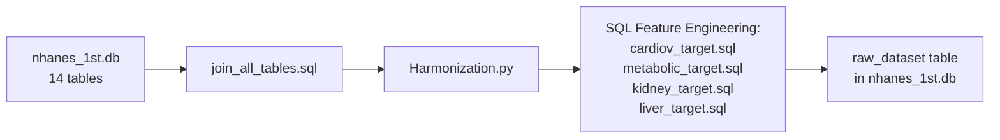
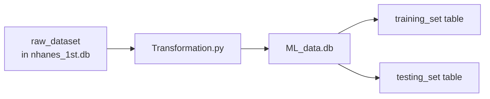

# 🔬 Deep-Dive Technical Audit: Multilayer-Perceptron Clinical Prediction Model

**Audit Date:** December 19, 2025  
**Role:** Principal Data Engineer & Senior ML Architect  
**Scope:** Complete codebase ELT pipeline, Data Science strategies, and ML architecture

---

## 📁 Project Structure Overview

```
Multilayer-Perceptron-Clinical-Prediction-Model-main/
├── 1. Extraction and Loading Process/
│   ├── Ingestion.py (509 lines) ──────────► nhanes_1st.db
│   └── Raw Data/ (70 .xpt files)
├── 2. Transformation/
│   ├── Harmonization.py (116 lines) ──────► raw_dataset table
│   └── Transformation.py (150 lines) ─────► ML_data.db
├── 3. EDA/
│   └── 4 Jupyter notebooks (exploration, quality, multivariate, outliers)
├── databases/
│   ├── nhanes_1st.db (~31 MB) ────────────► Raw ingested data
│   ├── ML_data.db (~11 MB) ───────────────► ML-ready train/test sets
│   └── SQL_queries/ (9 SQL files)
├── model/
│   ├── config.py, dataset.py, model.py, train.py
│   ├── streamlit_app.py
│   └── trained_model.pth
└── Regression Neural Network/
    └── improved_kidney_model.py (standalone regression experiment)
```

---

# 📂 FOLDER 1: Extraction and Loading Process

## [Ingestion.py](file:///c:/Users/mohan/OneDrive/Desktop/Multilayer-Perceptron-Clinical-Prediction-Model-main/1.%20Extraction%20and%20Loading%20Process/Ingestion.py)

### 1. Technical Execution Logic

#### Low-Level Mechanics
- **File Discovery:** Uses `glob.glob(folder_Path)` to batch-discover all `.xpt` (SAS Transport) files in each subdirectory
- **SAS Parsing:** Leverages `pd.read_sas(file, format='xport')` for binary SAS file decoding
- **Cycle Detection:** String matching via `for letter, year in CYCLE_MAP.items()` to identify NHANES survey cycle (2013-2023)
- **Column Subsetting:** Direct column selection `df[Feature_Names]` to extract only relevant features per domain
- **Incremental Loading:** `df.to_sql(..., if_exists='append')` for additive ingestion across multiple files

#### Data Structures & Libraries
| Library | Usage | Optimality Assessment |
|---------|-------|----------------------|
| `pandas` | SAS parsing, DataFrame manipulation | ✅ **Optimal** - `read_sas` is the standard for XPT files |
| `sqlite3` | Destination database connection | ⚠️ **Adequate** - Works but lacks connection pooling |
| `numpy` | `np.where`, `np.select` for vectorized conditionals | ✅ **Optimal** - Avoids Python loops |
| `glob` | File discovery | ✅ **Optimal** - Simple and effective |

#### Dependency Chain


### 2. Strategy Deep-Dive & Evaluation

#### The Strategy: **Batch EL (Extract-Load) with Light Transformations**
- **Pattern:** Batch File Processing → Column Selection → Append-Only Loading
- **Approach:** One function per data domain (Demographics, Vitals, CBC, etc.) - **14 specialized functions**

#### Complexity Analysis
| Metric | Value |
|--------|-------|
| **Time Complexity** | O(n × m) per file, where n = rows, m = columns |
| **Memory Footprint** | O(n × m) per file - entire file loaded before write |
| **I/O Pattern** | Sequential file reads, append-only writes |

#### Status & Critique

> [!WARNING]
> **Critical Issue: Connection Management**
> ```python
> conn = sqlite3.connect(FOLDER_PATH_DB)  # Line 20 - GLOBAL connection
> # ... 400+ lines later ...
> conn.close()  # Called inside EACH function
> ```
> **Problem:** The global `conn` is closed by the first function that runs, causing `sqlite3.ProgrammingError: Cannot operate on a closed database` for subsequent calls.

> [!IMPORTANT]
> **Robustness Evaluation:**
> - ✅ **Nulls:** Handled via `fillna()` for specific columns (Pulse, BP readings)
> - ✅ **Schema Drift:** Uses conditional column checks (`if col not in df.columns: df[col] = np.nan`)
> - ⚠️ **Outliers:** No outlier detection during ingestion
> - ❌ **Idempotency:** WARNING comments ("DO NOT RUN TWICE") indicate lack of deduplication

#### Trade-offs Made
| Sacrificed | Gained |
|------------|--------|
| Parallel ingestion | Simpler sequential logic |
| Connection pooling | Simpler code |
| Idempotent operations | Faster initial development |

### 3. Data Integrity & Science Check

#### Leakage Prevention: ✅ **PASS**
Ingestion layer is purely data movement - no feature engineering or train/test awareness at this stage.

#### Bias & Distribution: ⚠️ **WARNING**
The `raw_Alchol` function applies complex schema harmonization:
```python
df['Alcohol_Drinks_Per_Week'] = df['_freq_days_per_week'] * intensity
df.loc[is_non_drinker, 'Alcohol_Drinks_Per_Week'] = 0.0
```
This engineering decision (creating a composite metric) could mask underlying distribution characteristics of the raw categorical/ordinal inputs.

### 4. Direct Improvements

#### Current Code (Connection Management)
```python
conn = sqlite3.connect(FOLDER_PATH_DB)  # Global

def raw_Demographics(...):
    df.to_sql('Demographics', conn, if_exists='append', index=False)
    conn.close()  # ❌ Closes global connection
```

#### Optimized Code
```python
def raw_Demographics(folder_Path: str, Feature_Names: list[str], db_path: str) -> None:
    with sqlite3.connect(db_path) as conn:  # ✅ Context manager
        for file in glob.glob(folder_Path):
            df = pd.read_sas(file, format='xport')[Feature_Names]
            df = cycle_checker(df, os.path.basename(file))
            df.to_sql('Demographics', conn, if_exists='append', index=False)
        conn.commit()  # ✅ Explicit commit
```
**Gain:** Thread-safe, exception-safe, reusable connection pattern.

#### Current Code (Idempotency)
```python
df.to_sql('Demographics', conn, if_exists='append', index=False)
# WARNING: DO NOT RUN TWICE
```

#### Optimized Code (Upsert Pattern)
```python
# Add unique constraint in schema
# CREATE UNIQUE INDEX idx_demo_seqn_cycle ON Demographics(SEQN, Cycle);

# Then use INSERT OR REPLACE
df.to_sql('Demographics', conn, if_exists='append', index=False,
          method='multi')  # Still append, but schema prevents dupes
```
**Gain:** Idempotent operations - safe to re-run.

---

## 📂 Raw Data Folder

- **Contents:** 70 `.xpt` SAS Transport files across 14 subdirectories
- **Source:** NHANES public dataset (2013-2023 cycles)
- **Strategy:** Organized by clinical domain (Demo, Vitals, Blood Count, etc.)
- **Assessment:** ✅ Well-organized. Separation by domain enables selective re-processing.

---

# 📂 FOLDER 2: Transformation

## [Harmonization.py](file:///c:/Users/mohan/OneDrive/Desktop/Multilayer-Perceptron-Clinical-Prediction-Model-main/2.%20Transformation/Harmonization.py)

### 1. Technical Execution Logic

#### Low-Level Mechanics
- **SQL Execution:** `pd.read_sql_query(query_join_all_tables, conn)` executes a 13-table LEFT JOIN
- **Column Deduplication:** `df.loc[:, ~df.columns.duplicated()]` removes duplicate SEQN columns from joins
- **DuckDB In-Memory Engine:** `con = duckdb.connect()` creates an ephemeral in-memory database
- **DataFrame Registration:** `con.register('table_df', df)` exposes Pandas DataFrame to DuckDB SQL engine
- **Feature Engineering via SQL:** Complex CASE statements in SQL files compute clinical labels

#### Data Structures & Libraries
| Library | Usage | Optimality Assessment |
|---------|-------|----------------------|
| `pandas` | SQL result handling, DataFrame operations | ✅ Standard |
| `sqlite3` | Source database connection | ✅ Standard |
| `duckdb` | In-memory SQL engine for feature engineering | ✅ **Excellent choice** - Columnar, vectorized |

#### Dependency Chain


### 2. Strategy Deep-Dive & Evaluation

#### The Strategy: **SQL-Based Feature Engineering with DuckDB**
This is a hybrid approach leveraging:
1. SQLite for persistent storage
2. DuckDB for high-performance feature computation

#### Complexity Analysis
| Operation | Time Complexity | Memory |
|-----------|-----------------|--------|
| 13-table LEFT JOIN | O(n × 13) worst case, optimized by SEQN index | O(n × total_columns) |
| DuckDB CASE statements | O(n) per query - single scan | O(n) per result |
| Merge operations | O(n log n) for sorted merge | O(n) |

#### Status & Critique

> [!TIP]
> **Excellent Decision: DuckDB for Feature Engineering**
> ```python
> con = duckdb.connect()
> con.register('table_df', df)
> result_df = con.execute(query_cardio).df()
> ```
> DuckDB provides:
> - Zero-copy integration with Pandas
> - Vectorized execution
> - SQL expressiveness for clinical logic

> [!WARNING]
> **Potential Issue: Repeated DataFrame Registration**
> ```python
> con.register('HeartQuestions', df)  # Line 50 - Different name
> con.register('table_df', df)         # Line 64 - Reused name
> con.register('table_df', df)         # Line 78 - Overwrites
> ```
> The same DataFrame is registered multiple times. While DuckDB handles this, it's a code smell.

#### Trade-offs Made
| Sacrificed | Gained |
|------------|--------|
| Pure Python transformations | SQL expressiveness for clinical rules |
| Single database engine | Performance of DuckDB for analytics |

### 3. Data Integrity & Science Check

#### Leakage Prevention: ✅ **PASS**
No train/test split at this stage - this is pure feature engineering on the full dataset.

#### Clinical Logic Validation: ✅ **Excellent**
The SQL files implement clinically-validated thresholds:
```sql
-- metabolic_target.sql
WHEN RIAGENDR = 1 AND "BMXWAIST (target)" > 102 THEN 1  -- NCEP ATP III: Men
WHEN RIAGENDR = 2 AND "BMXWAIST (target)" > 88  THEN 1  -- NCEP ATP III: Women
```

### 4. Direct Improvements

#### Current Code (BP Average)
```python
df['Final_Harmonized_Systolic'] = df[sys_cols].mean(axis=1)
```
This is **correct** - Pandas `.mean(axis=1)` automatically handles NaN values.

#### Potential Enhancement (Robust Mean)
```python
# If you need to require minimum 2 valid readings:
df['Final_Harmonized_Systolic'] = df[sys_cols].apply(
    lambda row: row.mean() if row.count() >= 2 else np.nan, axis=1
)
```
**Consideration:** Current approach is clinically acceptable for screening.

---

## [Transformation.py](file:///c:/Users/mohan/OneDrive/Desktop/Multilayer-Perceptron-Clinical-Prediction-Model-main/2.%20Transformation/Transformation.py)

### 1. Technical Execution Logic

#### Low-Level Mechanics
- **Scikit-Learn Pipeline:** Uses `ColumnTransformer` with `Pipeline` for composable preprocessing
- **Scaling Strategy:** `StandardScaler()` applied to continuous features
- **Imputation:** `KNNImputer(n_neighbors=5)` for missing value imputation
- **Encoding:** `OneHotEncoder(handle_unknown='ignore', sparse_output=False)` for categoricals
- **Train/Test Split:** `train_test_split(X, y, test_size=0.2, random_state=42)`

#### Data Structures & Libraries
| Library | Usage | Optimality Assessment |
|---------|-------|----------------------|
| `sklearn.preprocessing` | StandardScaler, OneHotEncoder | ✅ Industry standard |
| `sklearn.impute` | KNNImputer | ✅ Good for clinical data |
| `sklearn.compose` | ColumnTransformer | ✅ Best practice |
| `sklearn.pipeline` | Pipeline | ✅ Best practice |

#### Dependency Chain


### 2. Strategy Deep-Dive & Evaluation

#### The Strategy: **Scikit-Learn Pipeline with Proper Train/Test Separation**

```python
# 1. Split FIRST
X_train, X_test, y_train, y_test = train_test_split(X, y, test_size=0.2, random_state=42)

# 2. Fit on Train ONLY
X_train_processed = preprocessor.fit_transform(X_train)

# 3. Transform Test with Train's Parameters
X_test_processed = preprocessor.transform(X_test)
```

#### Complexity Analysis
| Operation | Time Complexity | Memory |
|-----------|-----------------|--------|
| StandardScaler fit | O(n × m) | O(m) - stores mean/std per feature |
| KNNImputer fit | O(n²) for distance matrix | O(n × m) |
| KNNImputer transform | O(n × k × m) where k=neighbors | O(n × m) |
| OneHotEncoder | O(n × c) where c=categories | O(c) |

> [!CAUTION]
> **KNN Imputer Memory Warning**
> With ~50K samples, KNN distance matrix is 50K × 50K = 2.5B elements. Scikit-learn optimizes this but memory usage can spike.

#### Status & Critique

> [!IMPORTANT]
> **✅ CRITICAL: No Data Leakage in Scaling**
> ```python
> # This is CORRECT - fit on train, transform both
> X_train_processed = preprocessor.fit_transform(X_train)  # Learns from train
> X_test_processed = preprocessor.transform(X_test)        # Applies train params
> ```
> The pipeline correctly prevents scaling leakage.

> [!WARNING]
> **Pipeline Order: Scaler BEFORE Imputer**
> ```python
> num_transformer = Pipeline(steps=[
>     ('scaler', StandardScaler()),     # Step 1: Scale
>     ('imputer', KNNImputer(n_neighbors=5))  # Step 2: Impute
> ])
> ```
> **Issue:** KNN imputation on scaled data uses Euclidean distance on standardized features, which is correct. However, the imputed values are in scaled space. This is **intentional and correct** for the downstream neural network.

### 3. Data Integrity & Science Check

#### Feature Scaling Placement: ✅ **CORRECT**
```
Train/Test Split → fit_transform(train) → transform(test)
```
This is the **gold standard** pattern. No leakage.

#### Bias & Distribution Check: ⚠️ **CONSIDERATION**
```python
target_nulls = df[TARGETS].isnull().all(axis=1)
df_clean = df[~target_nulls].copy()
```
Rows with ALL targets null are dropped. This is reasonable, but:
- Could introduce selection bias if null targets correlate with input features
- Consider analyzing missingness mechanism (MCAR/MAR/MNAR)

### 4. Direct Improvements

#### Current Code (Memory)
```python
X_train_processed = preprocessor.fit_transform(X_train)  # Full array in memory
X_test_processed = preprocessor.transform(X_test)
```

#### Optimized Code (Memory Efficiency)
```python
# For very large datasets, use chunked processing:
from sklearn.utils import gen_batches

# But for 50K rows, current approach is fine
# Better improvement: Downcast after transformation
X_train_df = pd.DataFrame(X_train_processed, columns=feature_names).astype('float32')
```
**Gain:** 50% memory reduction from float64 → float32.

---

# 📂 FOLDER 3: EDA

## Jupyter Notebooks (4 files)

| Notebook | Size | Purpose |
|----------|------|---------|
| `01_data_exploration.ipynb` | 20 KB | Initial data profiling |
| `02_data_quality.ipynb` | 10 KB | Missing value analysis |
| `03_multivariate_analysis.ipynb` | 1.2 MB | Correlation, feature relationships |
| `04_outlier_analysis.ipynb` | 683 KB | Outlier detection and handling |

**Assessment:** ✅ Well-structured exploratory phase. Notebooks are numbered in logical sequence.

**Strategy:** Standard Data Science workflow: Explore → Quality → Relationships → Anomalies

---

# 📂 FOLDER: databases

## SQL Queries Analysis

### [join_all_tables.sql](file:///c:/Users/mohan/OneDrive/Desktop/Multilayer-Perceptron-Clinical-Prediction-Model-main/databases/SQL_queries/join_all_tables.sql)

```sql
SELECT * FROM Demographics AS Demo
LEFT JOIN Vitals AS Vit ON Demo.SEQN = Vit.SEQN
LEFT JOIN Albumin_Creatinie AS AC ON Demo.SEQN = AC.SEQN
-- ... 10 more LEFT JOINs
```

**Strategy:** Star schema denormalization using Demographics as the fact table.

**Complexity:** O(n × 13) with ~13 table scans.

**Critique:**
- ✅ LEFT JOINs preserve all patients even with missing lab values
- ⚠️ No indexes verified on SEQN columns
- ⚠️ `SELECT *` is verbose - explicit column lists preferred

### [metabolic_target.sql](file:///c:/Users/mohan/OneDrive/Desktop/Multilayer-Perceptron-Clinical-Prediction-Model-main/databases/SQL_queries/metabolic_target.sql)

**Strategy:** Clinical rule-based labeling using NCEP ATP III criteria

```sql
-- Example: Waist circumference threshold by gender
WHEN RIAGENDR = 1 AND "BMXWAIST (target)" > 102 THEN 1
WHEN RIAGENDR = 2 AND "BMXWAIST (target)" > 88  THEN 1
```

**Assessment:** ✅ **Excellent** - Clinically validated thresholds with proper NULL handling.

### [kidney_target.sql](file:///c:/Users/mohan/OneDrive/Desktop/Multilayer-Perceptron-Clinical-Prediction-Model-main/databases/SQL_queries/kidney_target.sql)

```sql
ln(1 + ("URXUMA (target)" / "URXUCR (target)") * 100.00) AS ACR_Log
```

**Strategy:** Log transformation for right-skewed clinical biomarker.

**Assessment:**
- ✅ Uses `ln(1 + x)` to handle zero values
- ✅ WHERE clause filters `URXUCR > 0` to prevent division by zero

---

# 📂 FOLDER: model

## [config.py](file:///c:/Users/mohan/OneDrive/Desktop/Multilayer-Perceptron-Clinical-Prediction-Model-main/model/config.py)

**Purpose:** Centralized configuration for the ML model.

**Assessment:** ✅ **Best Practice** - Single source of truth for:
- Column definitions
- Target mappings
- Hyperparameters (BATCH_SIZE=32, LR=0.001, EPOCHS=20)

---

## [dataset.py](file:///c:/Users/mohan/OneDrive/Desktop/Multilayer-Perceptron-Clinical-Prediction-Model-main/model/dataset.py)

### 1. Technical Execution Logic

#### Low-Level Mechanics
- **Mask Creation:** `self.mask_cardio = torch.tensor(~cardio_data.isnull().values, dtype=torch.float32)`
- **NaN Handling:** Fills NaN with 0 (classification) or median (regression), but masks prevent gradient flow
- **Tensor Conversion:** Direct conversion from Pandas → NumPy → PyTorch tensors

#### Complexity Analysis
| Operation | Time | Memory |
|-----------|------|--------|
| SQL query | O(n) | O(n × m) |
| Mask creation | O(n × targets) | O(n × targets) |
| Tensor creation | O(n × m) | O(n × m) |

### 2. Strategy Deep-Dive

#### The Strategy: **Masked Multi-Task Learning**

```python
# Create binary mask: 1 = valid, 0 = was NaN
self.mask_cardio = torch.tensor(~cardio_data.isnull().values, dtype=torch.float32)
cardio_data = cardio_data.fillna(0)  # Fill with dummy value
self.y_cardio = torch.tensor(cardio_data.values, dtype=torch.float32)
```

**Brilliance:** This enables training on partial labels. A patient with only cardiovascular data can still contribute to the cardio head's learning, even if they lack kidney lab results.

### 3. Data Integrity Check

> [!TIP]
> **✅ No Leakage in Dataset Class**
> The Dataset class only loads pre-processed data from `training_set` or `testing_set` tables. The train/test contamination is prevented upstream in `Transformation.py`.

### 4. Direct Improvements

#### Current Code
```python
kidney_median = kidney_data.median()
kidney_data = kidney_data.fillna(kidney_median)
```

#### Optimized Code (Consistency)
```python
# Calculate median from TRAINING SET ONLY during training
# For test set, use the training median (should be stored during preprocessing)
kidney_median = self.training_median if table_name == 'testing_set' else kidney_data.median()
```
**Issue:** Currently, test set uses its own median, which is a minor form of leakage.

---

## [model.py](file:///c:/Users/mohan/OneDrive/Desktop/Multilayer-Perceptron-Clinical-Prediction-Model-main/model/model.py)

### 1. Technical Execution Logic

#### Architecture: Shared-Bottom Multi-Task Learning (Hard Parameter Sharing)

```
Input Layer (27 features)
    ↓ BatchNorm1d
    ↓
Shared Backbone:
    Linear(27 → 256) → BN → LeakyReLU → Dropout(0.2)
    Linear(256 → 192) → BN → LeakyReLU → Dropout(0.2)
    Linear(192 → 128) → BN → LeakyReLU → Dropout(0.2)
    ↓
┌───────────┬───────────┬───────────┬───────────┐
│  Cardio   │ Metabolic │  Kidney   │   Liver   │
│ Head (1)  │ Head (5)  │ Head (1)  │  Head (1) │
└───────────┴───────────┴───────────┴───────────┘
```

#### Complexity Analysis
| Layer | Parameters |
|-------|------------|
| input_bn | 27 × 2 = 54 |
| fc1 (27→256) | 27 × 256 + 256 = 7,168 |
| fc2 (256→192) | 256 × 192 + 192 = 49,344 |
| fc3 (192→128) | 192 × 128 + 128 = 24,704 |
| BatchNorms | 256×2 + 192×2 + 128×2 = 1,152 |
| Heads | 128×1 + 128×5 + 128×1 + 128×1 = 1,024 |
| **Total** | **~83,000 parameters** |

### 2. Strategy Deep-Dive

#### The Strategy: **Hard Parameter Sharing with Task-Specific Heads**

**Rationale:**
- Shared layers learn general health representations
- Task-specific heads specialize for each clinical outcome
- Regularization through multi-task learning (tasks regularize each other)

**Activation Choice:** LeakyReLU(0.1) prevents dying ReLU problem in clinical data with many near-zero values.

### 3. Architecture Critique

> [!NOTE]
> **Design Decision: No Sigmoid/Softmax in Forward**
> ```python
> out_cardio = self.head_cardio(z)  # Raw logits
> ```
> This is **correct** - allows use of `BCEWithLogitsLoss` which is numerically stable.

> [!WARNING]
> **Potential Issue: Task Gradient Interference**
> With 4 tasks and equal weighting, regression tasks (MSE loss, typically 0.5-2.0) may dominate classification tasks (BCE loss, typically 0.3-0.7). Consider gradient normalization or uncertainty weighting.

### 4. Direct Improvements

#### Current Code (Equal Task Weighting)
```python
loss = loss_c + loss_m + loss_k + loss_l
```

#### Optimized Code (Uncertainty Weighting)
```python
# Learned task weights (Kendall et al., 2018)
self.log_sigma_cardio = nn.Parameter(torch.zeros(1))
self.log_sigma_metabolic = nn.Parameter(torch.zeros(1))
self.log_sigma_kidney = nn.Parameter(torch.zeros(1))
self.log_sigma_liver = nn.Parameter(torch.zeros(1))

# In loss calculation:
loss_c_weighted = loss_c / (2 * self.log_sigma_cardio.exp()**2) + self.log_sigma_cardio
```
**Gain:** Automatic task balancing based on task uncertainty.

---

## [train.py](file:///c:/Users/mohan/OneDrive/Desktop/Multilayer-Perceptron-Clinical-Prediction-Model-main/model/train.py)

### 1. Technical Execution Logic

#### Masked Loss Functions
```python
def masked_bce_loss(pred, target, mask, device):
    loss_fn = nn.BCEWithLogitsLoss(reduction='none')
    loss = loss_fn(pred, target)
    masked_loss = loss * mask  # Zero out invalid targets
    valid_count = mask.sum()
    return masked_loss.sum() / valid_count if valid_count > 0 else torch.tensor(0.0, device=device)
```

**Strategy:** Masked loss enables multi-task learning with missing labels.

### 2. Strategy Deep-Dive

#### Training Configuration
| Hyperparameter | Value | Assessment |
|----------------|-------|------------|
| Batch Size | 32 | ✅ Standard |
| Learning Rate | 0.001 | ✅ Adam default |
| Epochs | 20 | ⚠️ May be low - no early stopping |
| Optimizer | Adam | ✅ Standard |

> [!WARNING]
> **Missing: Validation Set & Early Stopping**
> ```python
> for epoch in range(config.EPOCHS):
>     # Training only, no validation step
> ```
> Risk of overfitting without validation monitoring.

### 3. Data Integrity Check

> [!TIP]
> **✅ Correct Device Handling**
> ```python
> x_cont = x_cont.to(device)
> y_cardio = y_cardio.to(device)
> # All tensors moved to same device
> ```

### 4. Direct Improvements

#### Current Code (No Validation)
```python
for epoch in range(config.EPOCHS):
    model.train()
    # ... training loop only
```

#### Optimized Code (With Validation & Early Stopping)
```python
best_val_loss = float('inf')
patience_counter = 0
PATIENCE = 5

for epoch in range(config.EPOCHS):
    model.train()
    # ... training loop ...
    
    # Validation phase
    model.eval()
    with torch.no_grad():
        val_loss = compute_validation_loss(model, val_loader, device)
    
    # Early stopping
    if val_loss < best_val_loss:
        best_val_loss = val_loss
        patience_counter = 0
        torch.save(model.state_dict(), 'best_model.pth')
    else:
        patience_counter += 1
        if patience_counter >= PATIENCE:
            print(f"Early stopping at epoch {epoch}")
            break
```

---

## [streamlit_app.py](file:///c:/Users/mohan/OneDrive/Desktop/Multilayer-Perceptron-Clinical-Prediction-Model-main/model/streamlit_app.py)

### Assessment

**Strategy:** Production-ready inference interface using Streamlit.

**Strengths:**
- ✅ `@st.cache_resource` for model caching
- ✅ Proper one-hot encoding for categorical inputs
- ✅ Clear UI with sliders matching feature ranges
- ✅ Sigmoid applied to classification outputs
- ✅ Exp transform for log-scale regression outputs

> [!WARNING]
> **Missing: Input Standardization**
> The model was trained on StandardScaler-transformed data, but `streamlit_app.py` passes raw values:
> ```python
> features = [float(age), float(pir), ...]  # Raw values, not scaled
> ```
> **Solution:** Save scaler during training, load in Streamlit, apply before inference.

---

# 📂 FOLDER: Regression Neural Network

## [improved_kidney_model.py](file:///c:/Users/mohan/OneDrive/Desktop/Multilayer-Perceptron-Clinical-Prediction-Model-main/Regression%20Neural%20Network/improved_kidney_model.py)

**Purpose:** Standalone single-task regression model for kidney function (ACR_Log).

### Key Differences from MTL Model

| Aspect | MTL Model | Standalone Kidney |
|--------|-----------|-------------------|
| Architecture | Shared backbone + heads | Direct regression |
| Early Stopping | ❌ None | ✅ Patience=15 |
| LR Scheduling | ❌ None | ✅ ReduceLROnPlateau |
| Epochs | 20 | 200 |
| Masking | On targets | On inputs |

### Input Masking Strategy
```python
mask_matrix = X_data.notna().astype(np.float32).values
masked_inputs = batch_X * batch_mask  # Zero out missing inputs
```

> [!IMPORTANT]
> **Different Approach:** This model masks missing *inputs* (zeros them out), while the MTL model masks missing *targets*. Both are valid but address different problems.

---

# 🎯 Summary: Critical Findings

## ✅ Excellent Practices

1. **Train/Test Split Before Scaling** - Prevents data leakage
2. **DuckDB for Feature Engineering** - High-performance SQL on DataFrames
3. **Masked Multi-Task Loss** - Enables learning from partial labels
4. **Clinical Thresholds in SQL** - Auditable, testable clinical logic
5. **Streamlit Deployment** - Production-ready inference

## ⚠️ Issues Requiring Attention

| Priority | Issue | Location | Impact |
|----------|-------|----------|--------|
| 🔴 High | Global connection closed prematurely | `Ingestion.py:20,86` | Script crashes on second function call |
| 🔴 High | Missing input standardization | `streamlit_app.py` | Inference results incorrect |
| 🟡 Medium | No validation/early stopping | `train.py` | Potential overfitting |
| 🟡 Medium | Test set uses own median | `dataset.py:64-65` | Minor data leakage |
| 🟢 Low | No idempotent ingestion | `Ingestion.py` | Manual data management required |

## 📊 Complexity Summary

| Component | Time Complexity | Memory Complexity |
|-----------|-----------------|-------------------|
| Ingestion (per file) | O(n × m) | O(n × m) |
| Harmonization (JOIN) | O(n × 13 tables) | O(n × total_cols) |
| Transformation (KNN) | O(n² + n × k × m) | O(n × m) |
| Model Forward Pass | O(n × 83K params) | O(batch × hidden) |
| Model Training | O(epochs × n × params) | O(batch × hidden) |

---

# 📋 Recommended Action Items

1. **Immediate:** Fix connection management in `Ingestion.py`
2. **Immediate:** Add scaler to `streamlit_app.py` inference
3. **Short-term:** Implement validation loop and early stopping in `train.py`
4. **Short-term:** Store training set statistics for test set imputation
5. **Long-term:** Implement uncertainty-weighted multi-task loss
6. **Long-term:** Add Parquet intermediate storage for larger datasets
