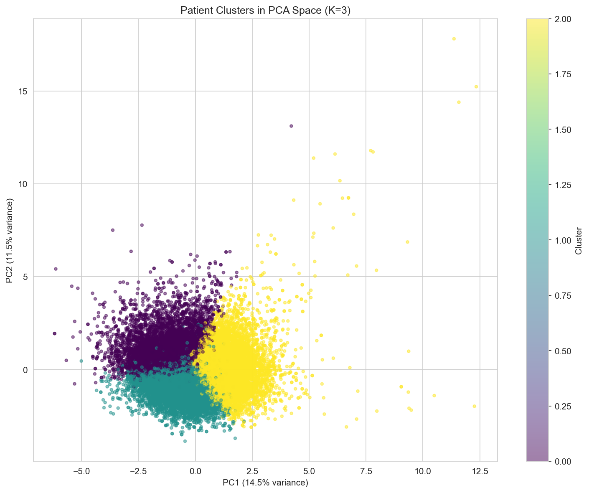

# Health Risks Prediction
### Deep Learning Model for: Heart | Diabetes | Kidney | Liver

---

# Our Neural Network

```
Patient Data                  🧠 Our Model                     Predictions
     ↓                              ↓                              ↓
Age, Weight,          →      [Learn Patterns]      →      ❤️ Heart Risk: 23%
Blood Pressure,                                           🍬 Diabetes Risk: 45%
Kidney, Liver Tests                                       🫘 Kidney Risk: 12%
                                                          🫀 Liver Risk: 8%
```

---

# The 3-Step Pipeline

```
            Step 1: ETL          Step 2: EDA          Step 3: MODEL

                📥                   🔍                   🤖
```

---

# Step 1: ETL 📥
- Source: **N**ational **H**ealth **a**nd **N**utrition **E**xamination **S**urvey (NHANES)
- **Folder:** `1. ETL/` - Collects and Cleans the data

---

# ETL: Pipeline

```
┌─────────────────┐    ┌─────────────────┐    ┌─────────────────┐
│  01_ingestion   │    │ 02_harmonize    │    │ 03_transform    │
│                 │    │                 │    │                 │
│    75 files     │───►│  Clean & Label  │───►│  StandardScaler │
│ 5 survey years  │    │                 │    │ Train/Test split│
└─────────────────┘    └─────────────────┘    └─────────────────┘
        │                      │                      │
        ▼                      ▼                      ▼
   Raw NHANES            34,097 patients         ML-Ready Data
```

---

# ETL: Data Sources

| Category | Examples |
|----------|----------|
| Demographics | Age, Gender, Ethnicity |
| Body Measures | BMI, Height, Waist |
| Blood Tests | CBC, Biochemistry |
| Metabolic | Glucose, Cholesterol, HDL, Triglycerides |
| Organ Function | Kidney (ACR), Liver (ALT/AST) |
| Lifestyle | Smoking, Alcohol |

**Total: 75 files → 34,097 patients**

---

<!-- _class: lead -->

# Step 2: EDA 🔍
## Exploratory Data Analysis

---

# EDA: Univariate Analysis

| Pattern | Features | Model Impact |
|---------|----------|--------------|
| **Heavy right skew** | liver_ast, liver_ggt, alcohol | Keep outliers (valid medical cases) |
| **58% missing** | glucose, triglycerides | Masked loss required |
| **Class imbalance** | CVD (88:12), Kidney (38:1) | Focal loss + pos_weight |
| **Uniform/normal** | age, BMI, height | No special handling |

---


---

# EDA: Bivariate Analysis

**Top correlated feature per task:**

| Task | Top Feature | Correlation |
|------|-------------|-------------|
| ❤️ CVD | age | **+0.32** |
| 🍬 Waist | BMI | **+0.85** |
| 🫘 Kidney | age | **+0.15** |
| 🫀 Liver | liver_ggt | **+0.42** |

**Insight:** Age predicts heart/kidney, BMI predicts waist, liver markers predict liver

---


---

# EDA: Outlier Analysis

```
            Z-Score vs IQR Outlier Detection

    alcohol_drinks_per_week    ████████████  11.9% outliers
    liver_ggt_U_L              █████████     8.8% outliers
    liver_ast_U_L              █████         5.2% outliers

    Decision: KEEP (medically valid extreme cases)
```

---


---

# EDA: Multivariate Analysis

| Method | Result | Model Impact |
|--------|--------|--------------|
| **PCA** | 90% variance | Some redundancy, keep all features |
| **K-Means** | 3 natural patient groups | Validates multi-task approach |

**Insight:** Patients cluster into different risk patterns

---



---

<!-- _class: lead -->

# Step 3: Model 🤖
## Architecture & Training

---

# Model Architecture


---

<!-- _class: invert -->


---

# Inside Each Neural Layer

- **Linear** - Weighted sum of inputs (learning)
- **BatchNorm** - Rescales numbers to average=0, spread=1 (stability)
- **LeakyReLU** - Keeps positives, scales negatives to 10% (non-linearity)
- **Dropout** - Randomly turns off 5% of neurons during training (prevent overfitting)

---

# Why This Design?

| Design Choice | Simple Explanation |
|---------------|-------------------|
| **Neural Network** | Can learn complex patterns |
| **Shared Backbone** | One brain learns features useful for all 4 predictions |
| **4 Separate Heads** | Each condition gets specialized output |
| **Multi-Task Learning** | Training on 4 tasks together makes each task better |

---

<!-- _class: lead -->

# Model Evaluation 📊

---

# Training Progress

<!-- Loss decreasing over epochs = model is learning -->


---

# Results: Cardiovascular Disease ❤️

| Metric | Value | Meaning |
|--------|-------|---------|
| **ROC-AUC** | **0.83** | Good ranking ability |
| **Recall** | 55.8% | Catches 56% of sick patients |
| **Accuracy** | 83.5% | Overall correctness |

```
Confusion Matrix:     Predicted
                    Healthy   CVD
Actual  Healthy      5649     838
        CVD           375     473  ← Caught!
```

---

# Results: Metabolic Syndrome 🍬

| Component | Accuracy | ROC-AUC |
|-----------|----------|---------|
| **Waist** | **90.9%** | **0.97** |
| Triglycerides | 67.4% | 0.73 |
| HDL | 67.5% | 0.74 |
| Blood Pressure | 67.0% | 0.74 |
| Glucose | 65.4% | 0.69 |

**Overall Micro-F1: 0.72**

---

# Results: Kidney Function 🫘

| Class | Recall | Count |
|-------|--------|-------|
| **Normal** | **84.0%** | 5,681 |
| Microalbuminuria | 37.1% | 1,003 |
| Macroalbuminuria | 30.1% | 203 |

**Challenge:** Only 203 severe cases (2%) → hard to learn

---

# Results: Liver Dysfunction 🫀

| Metric | Value |
|--------|-------|
| **ROC-AUC** | **0.92** |
| **Accuracy** | **88.3%** |
| **Macro-F1** | **0.82** |

```
Confusion Matrix:     Predicted
                    Normal  Dysfunction
Actual  Normal       4884      279
        Dysfunction   501      977  ← Best performer!
```

---

# Overall Performance Summary

| Task | ROC-AUC | Macro-F1 | Verdict |
|------|---------|----------|---------|
| ❤️ Heart | 0.83 | 0.67 | ✅ Good |
| 🍬 Metabolic | 0.97* | 0.72 | ✅ Excellent (waist) |
| 🫘 Kidney | - | 0.50 | ⚠️ Needs work |
| 🫀 Liver | **0.92** | **0.82** | ✅ Best |

*Waist component only

---

# Key Metrics Explained

| Metric | What It Means | Our Goal |
|--------|---------------|----------|
| **ROC-AUC** | Can model rank sick vs healthy? | > 0.75 ✅ |
| **Recall** | Of all sick people, how many caught? | > 50% ✅ |
| **Macro-F1** | Balance across all classes | > 0.60 ✅ |

---

# Thank You!

**Files to explore:**
- `2. EDA/` - All 7 analysis notebooks
- `3. Model/05_evaluate.py` - Evaluation code
- `3. Model/MODEL_EVALUATION_REPORT.md` - Full results

