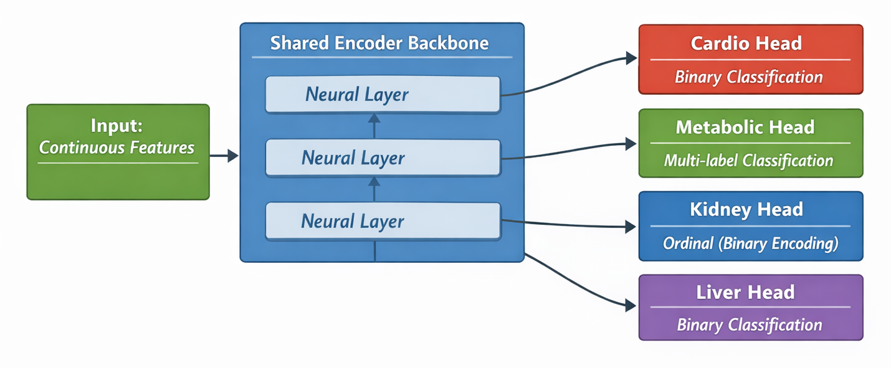
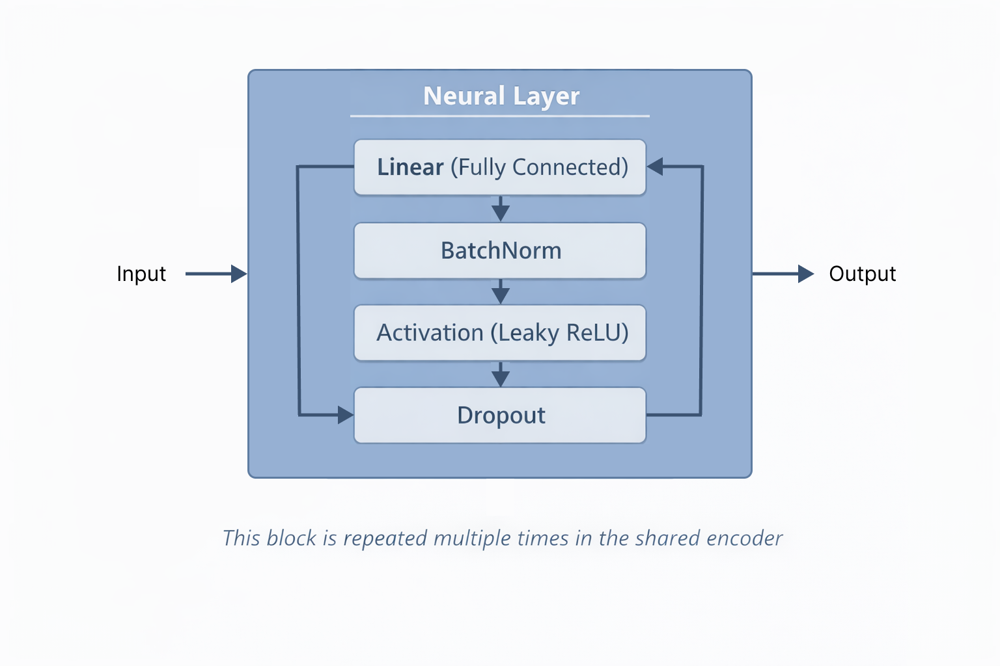

# Health Risks Prediction
### Deep Learning Model for: Heart | Diabetes | Kidney | Liver

---

# Our Neural Network

```
Patient Data                  🧠 Our Model                     Predictions
     ↓                              ↓                              ↓
Age, Weight,          →      [Learn Patterns]      →      ❤️ Heart Risk: 23%
Blood Pressure,                                           🍬 Diabetes Risk: 45%
Kidney, Liver Tests                                       🫘 Kidney Risk: 12%
                                                          🫀 Liver Risk: 8%
```

---

# The 3-Step Pipeline

```
            Step 1: ETL          Step 2: EDA          Step 3: MODEL

               📥                   🔍                   🤖
```

---

# Step 1: ETL 📥
- Source: **N**ational **H**ealth **a**nd **N**utrition **E**xamination **S**urvey (NHANES)
- **Folder:** `1. ETL/` - Collects and Cleans the data

---

# Step 2: EDA 🔍
- **Folder:** `2. EDA/` - Explore and understand the data

---

# Step 3: Model 🤖


---

<!-- _class: invert -->


---

# Inside Each Neural Layer

- **Linear** - Weighted sum of inputs (learning)
- **BatchNorm** - Rescales numbers to average=0, spread=1 (stability)
- **LeakyReLU** - Keeps positives, scales negatives to 10% (non-linearity)
- **Dropout** - Randomly turns off 20% of neurons during training (prevent overfitting)

---

# Why This Design?

| Design Choice | Simple Explanation |
|---------------|-------------------|
| **Neural Network** | Can learn complex patterns |
| **Shared Backbone** | One brain learns features useful for all 4 predictions |
| **4 Separate Heads** | Each condition gets specialized output |
| **Multi-Task Learning** | Training on 4 tasks together makes each task better |

---

# Thank You!
